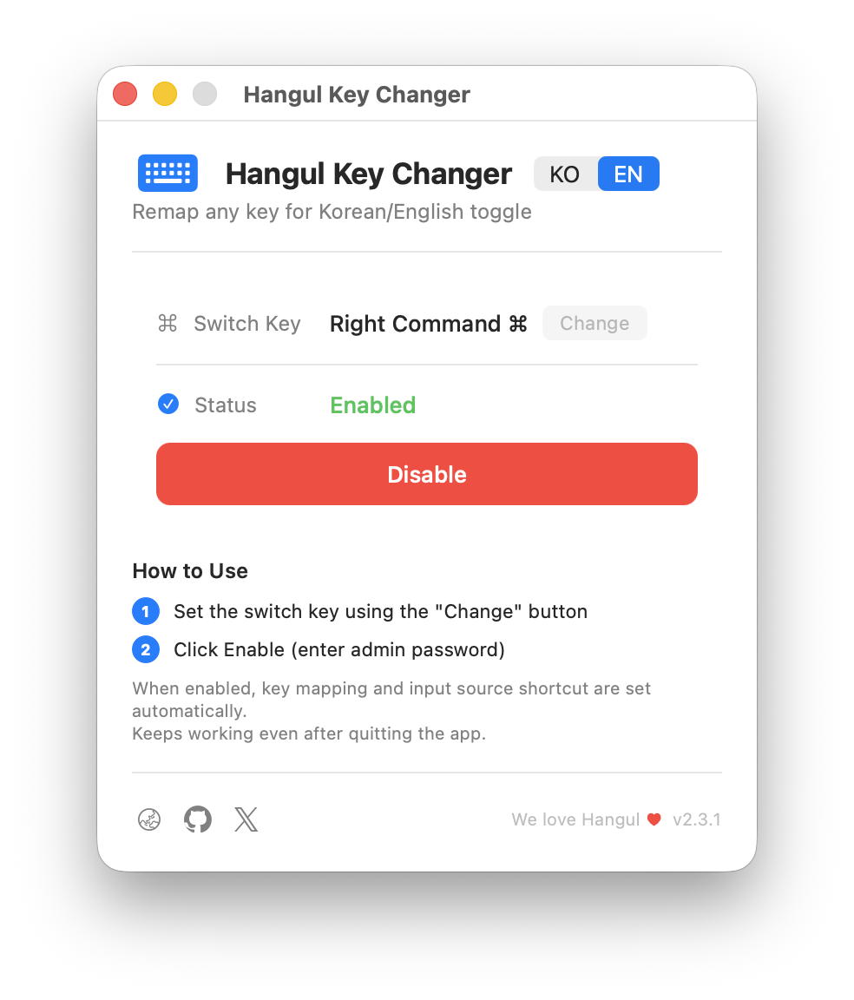

# Hangul Key Changer

A lightweight macOS utility that lets you toggle Korean/English input with **any key you choose** — no drivers, no complexity.


> [한국어 README](README.md)

<p align="center">
  
</p>

## Why?

Switching between Korean and English on macOS has always been awkward:

- **Caps Lock** has noticeable input delay and you lose its original function
- **Fn key** placement varies by keyboard and feels unnatural
- If you're used to **Windows keyboards**, you expect a dedicated toggle key on the right side

The common workaround is [Karabiner-Elements](https://karabiner-elements.pqrs.org/), which requires installing a kernel-level driver and writing complex JSON rules.

**Hangul Key Changer** takes a different approach — it uses only the built-in macOS `hidutil` command. No drivers, no kernel extensions, no background daemons. Lightweight and safe.

## Features

- **Remap any key** — Right Command, Caps Lock, or any key of your choice
- **One-click setup** — A single button configures both key mapping and system shortcut, no admin password required
- **Persists after reboot** — Registered as a login item, applied automatically at boot
- **No app needed after setup** — Close the app and the key mapping keeps working
- **Bilingual UI** — Switch between Korean and English instantly with the KO/EN toggle
- **No special permissions** — Works without drivers, kernel extensions, or accessibility permissions

## Install

### Homebrew (Recommended)

```bash
brew install hulryung/tap/hangulkeychanger
```

### DMG Download

Download the latest DMG from [Releases](https://github.com/hulryung/HangulKeyChanger/releases), open it, and drag the app to `/Applications`.

The app is signed with Developer ID and notarized by Apple — no security warnings.

## Usage

1. Launch the app
2. Click **Change** to pick your toggle key (default: Right Command)
3. Click **Enable**
4. Done — the selected key now toggles Korean/English input

<p align="center">
  <code>Right Command ⌘</code> → Input source toggle
</p>

The key mapping continues to work even after you quit the app. It is automatically reapplied after a reboot.

## Uninstall

1. Click **Disable** in the app to remove the key mapping
2. Delete the app

If installed via Homebrew:
```bash
brew uninstall hangulkeychanger
```

## How It Works

Hangul Key Changer operates in three steps:

1. **Key remapping**: Uses macOS built-in `hidutil` to remap your chosen key to F18
2. **System shortcut**: Sets the "Select previous input source" shortcut to F18 via symbolic hotkeys
3. **Persistence**: Registers as a login item via `SMAppService` so the mapping survives reboots

No external drivers or kernel extensions. No background daemon running. Just native macOS mechanisms.

### Tech Stack

| Component | Technology |
|---|---|
| Language | Swift 5 |
| UI Framework | AppKit (pure Cocoa) |
| Key Mapping | `hidutil` (HID Usage Table) |
| Persistence | SMAppService (Login Item) |
| Requirements | macOS 14.0 Sonoma or later |
| Signing | Developer ID + Apple Notarization |

## Use It Freely

This app requires no special permissions. No accessibility access, no input monitoring, no admin password. It only uses macOS's built-in `hidutil`, so it puts zero burden on your system.

The source code is released under the MIT License — feel free to use and modify it however you like.

## Build from Source

```bash
git clone https://github.com/hulryung/HangulKeyChanger.git
cd HangulKeyChanger
xcodebuild -scheme HangulCommandApp build
```

## Changelog

### v2.4.0
- Changed from menu bar app to standalone app
- Enable without admin password (using SMAppService)
- Added in-app KO/EN language switching
- Added About panel and menu bar
- Added footer with version, website/GitHub/X links
- Renamed app to "Hangul Key Changer"

### v2.3.1
- Included app icon in build artifacts

### v2.3.0
- Dark mode support
- Code quality improvements and notarization readiness

## License

[MIT](LICENSE)

## Links

- [Website](https://hkc.hulryung.com)
- [GitHub](https://github.com/hulryung/HangulKeyChanger)
- [X (Twitter)](https://x.com/hulryung)

---

<div align="center">

We still love Sebulsik (3-set Korean keyboard layout).

[](https://buymeacoffee.com/hulryung)

</div>
